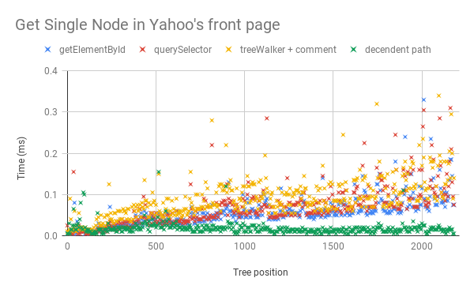

= How to Instantiate HTML Template Elements
:keywords: JavaScript, Templates
:date: 2020-08-10

I'm excited about template elements. There's no specified way of instantiating them, so let's talk about where they come from, why we use them, and how to instantiate them.

# Mommy, where do template elements come from?
Most likely, you won’t write them by hand. Instead, they’ll be generated from template literals, JSX, or something else. These generators will have to deal with template instantiation. By using template elements, these generators share the efficiency of using the built-in parser and cloning DOM sub-trees.

Where they will likely differ is in how they do reactivity. Template elements are a low level primitive and so low-level element access should be part of their instantiation. With references to elements, you can implement any reactive paradigm you want. This is what was lacking in the previous template instantiation proposal. It was consistent with the libraries that have pure render functions but wouldn’t have worked as well for libraries that use fine-grained reactivity.

# Why use template elements?
The efficiency of template elements comes from two things: they use the browser’s HTML parser, and instantiation uses sub-tree cloning.

Using the built-in HTML parser is fast because the browser turns the HTML directly into its internal DOM representation. Contrast that with VDOM or using `document.createElement` where you’re interacting with the underlying DOM using JavaScript objects that **wrap around** C++ DOM nodes. Like all JS objects, those wrappers use heap memory and need to be garbage collected. 

There’s a great presentation about garbage collection and how it’s implemented in V8 on the [V8 tech blog](https://v8.dev/blog/trash-talk). Garbage collectors assume that most objects die young, and thus they make short-lived objects cheaper than long-lived ones. For this reason, we want most wrappers to be short-lived. Only the wrappers to nodes we care about should stick around.

Second, cloning is a memory operation instead of a parsing one. We are conveying our intent to the browser more clearly — which is the best kind of optimization.

I should mention that cloning is only more efficient if you are going to use a template more than once. If you’re only going to create one of a template then it would be better to just use `innerHTML`. It’s the second and following times that you use a template that will benefit from cloning.

# How to instantiate a template element
After we have a template element, we need to instantiate it. First, we use `document.importNode` to get a document fragment. I haven’t yet needed to separate the cloning and adoption steps, but if you're curious then look at [this comment](https://github.com/Polymer/lit-html/blob/9bca692d7de685b3d93627ffd9b8fa7d2dccf3e3/src/lib/template-instance.ts#L55) in the lit-html source. Next is to get references to the elements we care about within that fragment. I know of three general ways of doing that. Let’s talk about each method and then compare them.

The first is to use `getElementById`, `getElementsByClassName`, or `querySelector`. It seemed reasonable to me that the browser might have caches to speed up these functions, but when I tested it I found that in Chrome Canary they all perform DOM searches.

The second method is to do a DOM traversal using the tree-walker API. Because you can collect all the references you need from a single traversal I thought this might beat the first method. To limit the number of node wrappers we create, we can filter our walker to comment nodes which we’ll use as our markers. Assuming your template contains no non-marker comment nodes, then only the node wrappers you want are created.

With the tree-walker, our reference collecting cost is linear to the size of the template rather than to the number of references we need times the size of the template.

The last method is what I’m calling a descendant path. I think I saw it in Svelte's compiled output. The descendant path is an array of integer indexes into the childNodes property that leads from the root to the node we want a reference to. This way, the complexity is the sum of the number of nodes we care about times their depth in the tree. Unfortunately, this method results in the most DOM node wrappers being created. The other two methods result in wrappers for only the nodes we want, while this method creates wrappers for each node along the path from the fragment root to the target.

Let’s look at the behavior of these methods. I downloaded the Yahoo homepage and turned it into a template element. I removed all the scripts and other embedded content. Then I timed how long it took to retrieve a reference to each node using each of the methods. The tree position is the index in a normal tree-walker traversal of the target node. There were more than 2000 elements in the template. Your templates will probably be smaller - sized like a small piece of UI. Using a large template demonstrates the linear behavior of the first two categories.

The good news is that all three of these methods have similar performance for small templates. The things to take away are these:
1. With a descendant path, we can do a minimal traversal.
2. For small templates, the JS overhead of using a tree-walker or the descendant path makes them slower than `getElementById` or `querySelector`. If you have more then one element, then using tree-walker, descendant path, or `querySelectorAll` would be better.
3. Make templates as large as you can. Doing so reduces the JS overhead of working with the DOM. Event delegation is one technique you could use to do this.
4. Lastly, why isn’t there a constant time method? This is the API that we’re missing and should be created as part of defining template instantiation. The browser has already touched all these nodes once when it parsed them and again when it cloned them from the template. What we need is a way of telling the browser at parse time what nodes we will want wrappers for.

The element fetching APIs we have come from back when sites sprinkled JavaScript around - only needing a few references. These days, there are sites where JavaScript manages the whole document. It’s time for an API that reflects that.

Something like a `<marker name="location-1">` node and `marker="location-2"` attribute would work. Then during parsing and cloning, the browser would put these nodes into a dictionary. That dictionary would be available on the document or document fragment. The API doesn't have to look like this. As long as the browser can understand our intentions, it can optimize them.

# Reduce, Reuse, Recycle
Once your instance is no longer needed, you remove it from the DOM. You could let it be garbage collected, or you could preserve it in a pool. Pooling is an advanced topic, and I’m not qualified to talk about it anyway (what is a high water-mark?).

Pooling makes objects long-lived and more expensive. In return, we can skip cloning and collecting references from it. You want to make sure that when you don’t need the template anymore, its pool can be garbage collected. A good way to do this is with a weak-map.

To make a template reusable you need two things:
1. All changes you make to the template instance need to be reversible. That is, you have to be able to clean the instance so that it’s ready for reuse.
2. You need to be able to retrieve the instance from the DOM. This means putting the nodes back into a document fragment to be returned to the pool.

# Conclusion
So how do you instantiate a template element? If it’s small and you only need a few references, then using querySelector or getElementById is fine. If your template is large, then prefer querySelectorAll, tree-walker, or descendant path. Consider pooling the instance to save the cost of cloning and finding references. And if you’re part of a standardizing body then I'd love to talk about a constant-time element access API.