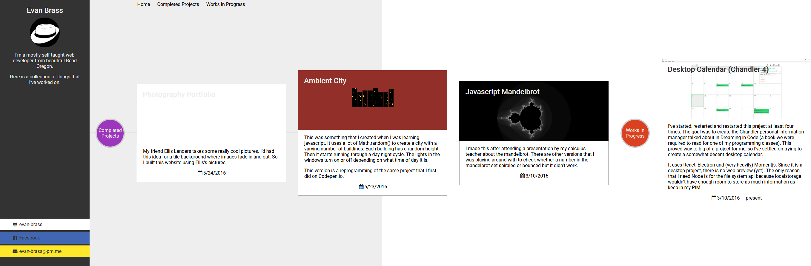

= Building this Site
:date: 2020-07-30
:draft:

# Version 1: First portfolio
This website has had four to five (attempted) iterations.  The first was a simple portfolio with some cards.  On hover, a short description about each project was visible.

The characteristics of this version I would summarize as:
* "Everything on the web should be in sans-serif"
* Cards!  Must have cards!
* Not mobile friendly or accessible (the description was only visible on hover, for instance)
* Layout was accomplished with: margins, floats, and inline-block

# Version 2: Free Code Camp portfolio
Eventually I wanted to redesign my portfolio.  I had been doing some of the Free Code Camp projects and decided to use the portfolio project to prototype the next version.

This version never actually made it live.  It stayed as a CodePen.  The fact is that horizontal layout is hard.  Of perticular concern is redirecting the scroll wheel so that a user isn't forced to use the scroll bars.  However, every time I've tried to do something using scroll I've encountered differences between browsers and devices.  Sometimes it's too fast and sometimes it's too slow.  If there was a way to tell the browser to make horizontal scrolling primary then maybe it would work better.

Summary:
* Horizontal Layout
* I'd discovered [Coolors.co](https://coolors.co/generate) and just wanted to start including colors - any colors.
* "Whoah! You can make a circle with `border-radius: 50%;`! I gotta use that in a few places."
* Font-Awesome for icons
* "Cards are still cool"
* My white hat profile picture makes it's first appearance.

# Version 3: Static Site
You might say I saw the light and became convicted that most websites should be static sites - we should be using website compilers.  With that being said, my first forays into static site generators weren't very successful.  People talk about opinionated as being a good thing, but I mostly disagree.  There are several options for each property of a static site generator and the number of possible combinations is very large.  Where as if there was instead swappable components, maybe there wouldn't be as many.  Each static site generator makes choices about:
* What templating language to use?
* How to enable some amount of scripting within that language?
* What language is used for configuration?
* How is the content layed out into folders?
* Do you support resizing images?  What formats?  What about compression?  How far are you away from being able to support WebP?
* etc.

One of the core features of Wordpress is plugins.  Maybe I've missed it but it doesn't seem like static site generators have made plugins available yet.  Logically, I think plugins are just inevitable for static site generators.  What that's going to look like I'm not sure.

Before settling on Zola, I tried Zola, Cobalt, and Hugo.  One complaint I have about these has been syntax highlighting.  You might not know, but this site has a light mode and a dark mode.  There's no UI switch, though if you open dev tools and emulate `prefers-color-scheme: dark` or `light` you'll see it.  Unfortunately, the code blocks are always dark.  This comes from Syntect (the syntax highlighter in Zola), but Syntect uses Sublime text themes and syntax files.  This is great because Sublime has so many community languages and themes.  Sadly, whether by Sublime spec or by Syntect's implementation, I couldn't use CSS variables for the colors.  This has made me realize that I should probably use Zola instead of Hugo, because whatever static site generator I use I'll probably need to modify it.  I'm learning Rust and I've never used Go, therefore the liklihood of me being able to edit Zola is higher than being able to edit Hugo.

Another issue that I've had has been images.  I was briefly excited to make an AMP powered website.  That would have been an abuse of AMP's limited scope: efficient above-the-fold prerendering for that "instant" loading experience.  I was content with minimal JS and content first, but I feel strongly about using as semantic HTML as you can.  To me, that means using tags like `<figure>` and `<figcaption>` (not to be confused with the table's `<caption>` element), `<header>`, `<footer>`, `<main>`, `
`, etc.  My thinking is that built in browser features are most likely more accessible, search engine friendly, and just generally better crafted than what I could build on my own.  I respect companies that spend enough engineering effort and build "better-than-builtin" components.

I have to not use much javascript here, though, because I lack the focus that would lead to a better-than-builtin experience.  Maybe one day I'll have a 100% PWA score in lighthouse but for now I'm content with working on content.

## Design goals:

---
* Github Site evolution:
	* First version: Portfolio
		* Cards
		* Excited when I learned about GitHub Pages: "I can build websites that I can share with people!"
			* Started as a portfolio: Mandelbrot, City thing, Dotty, Chandler, etc.
	* Free Code Camp: Portfolio
		* Cards
		* Horizontal Scroll
		* More color
	* Current: Blog
		* Static Site (Zola, but tried Hugo and others)
		* Long form content: Matches my switch from building cool things to look at -> cool things to program
			* Stories
			* What did I learn - even if other people already know it.
		* Really, really wanted to make a horizontal-scrolling, column-based, layout work
			* Horizontal scrolling is hard on desktop (easy on mobile)
			* CSS column widths are quite variable - column-width is only a hint to the browser
			* Reminds me of books
			* Having column breaks and wrapping give the user pause to think - unlike bottomless infinite scroll of doom
			* Nostalgic: Newspapers, Magazines, etc.
				* Takes effort and craft - but hard on variable devices.
			* I intend to keep attempting it.  Maybe one day this site will have a horizontal layout.
		* Not trying to get a job with it
		* Advocate for things I don't think will be popular
		* Communicate what I'm working on to make it worthwhile
		* Document myself / my life
		* Heavily inspired by Medium
			* Text Focused - instead of icons and images
				* Small-caps for dates and nav links
			* Few colors and lots of negative space
			* This also uses simple markup which I hope is screen reader accessible since I can't focus on that at the moment.
				* I've been down the screen reader hole and learned that I need to learn how to use a screen reader better in order to understand if my site is accessible.
		* Fewer barriers to writing:
			* Lower quality than I would put into a Medium article
				* Since I have controversial beliefs, I feel like I have to put extra effort in - It's easy for me to swim against the flow on my own but if I want to talk to other people then swimming against the flow becomes really difficult
					* Most Medium readers probably wouldn't be interested in what I have to say and I wouldn't want to disappoint them by using up one of their free reads.  And if I don't enable curration then there's little point in using Medium for distribution.
			* Static site generator
			* Minimal javascript (I'm picky about Javascript and get sucked in)
			* Learn to be content with imperfection
		* Respectful: 
			* Dark mode support
			* Testing for vision deficiencies
			* Need to work on keyboard usage experience
			* Be privacy preserving (only privacy preserving analytics and comments)
			* Focus on efficient size
				* Responsive image support with layout reservation
			* Microdata for crawlability
		* Chose Zola because I'm learning Rust and am more likely to be able to modify it than Hugo
			* Need to make the Syntax highlighting support css styling
		* Learn about professional website design / administration
			* Verified site owner with Google and Bing
				* Just messing around for now.
				* Currious about how to make syndication between Medium and this blog
					* How do "link juices" flow?
					* Medium has income, curation / distribution,  and commenting but also has a paywall
						* I'd like to get people here so that they can read for free and perhaps I can someday build a community around my interests.
				* While I learn: Hoping that being genuine and content focused (simple) will be good enough
					* I'm a real noob
				* Tried to get rich results but that requires an image for each article and I'm probably not going to do that, so I'll just use microdata as much as fits my content.
			* I want to setup this blog so that it's easy enough to maintain that I could comfortably hand it off to a customer.
				* I played with Forestry.io with the Hugo version, but am having trouble setting it up for this version.  Maybe the dodgy git has something to do with it.
				* Intend to play with Netlify (Maybe forms and stuff?)
